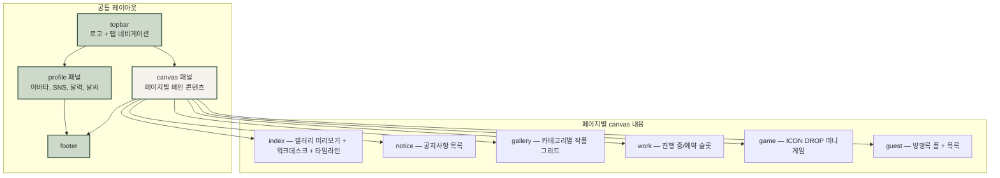
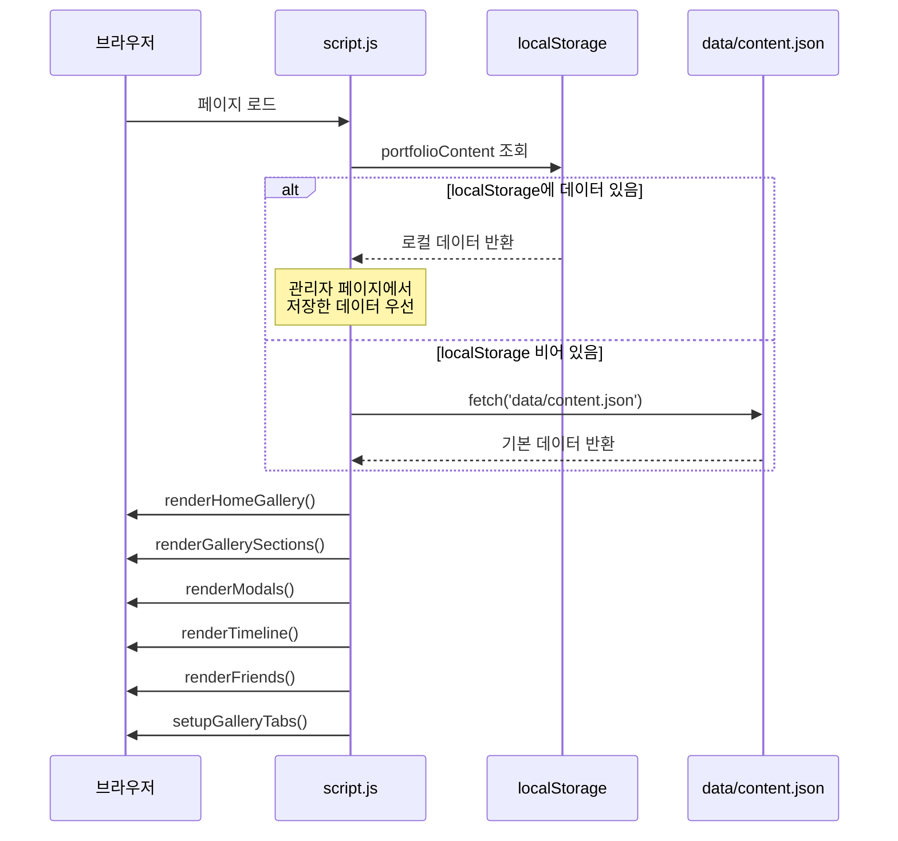
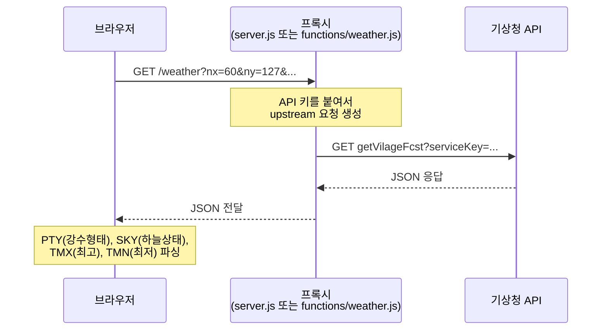
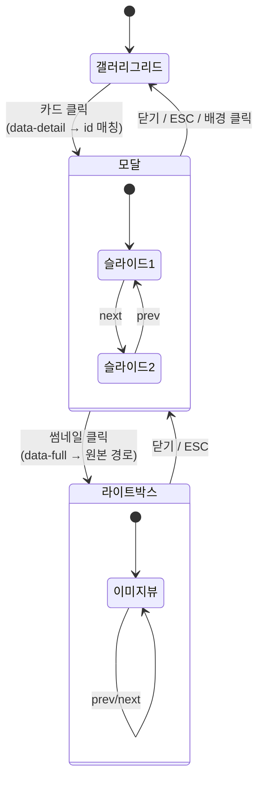

# [포트폴리오] 프로젝트 구조 가이드

이 프로젝트는 "dago 다고"의 개인 포트폴리오 사이트다. 2000년대 미니홈피 감성을 현대 웹 기술로 재현한 ==정적 사이트==이며, Cloudflare Pages로 배포한다. 프레임워크 없이 순수 HTML/CSS/JS로 구성되어 있고, 서버 사이드 로직은 Cloudflare Pages Functions가 담당한다.


## 디자인 컨셉

전체 톤은 ==저채도 그린 + 종이 질감==이다. CSS 변수로 팔레트를 관리한다.

- **green-900** : `#243a2b` — 가장 짙은 텍스트
- **green-700** : `#3c5a47` — 주요 UI 요소
- **green-500** : `#6c8a72` — 보조색
- **mint** : `#cdd9c9` — 배경 액센트
- **cream** : `#f6f3ee` — 밝은 배경
- **paper** : `#faf9f5` — 카드/패널 배경

폰트는 `Nanum Gothic Coding`과 `IBM Plex Mono`를 사용한다. 모노스페이스 조합이라 타자기 느낌을 낸다. 배경에는 SVG `feTurbulence` 필터로 종이 노이즈 텍스처를 깔아둔다.


## 페이지 구성

사이트는 6개 페이지로 나뉜다. 모든 페이지가 공통 헤더(로고 + 탭 네비게이션)와 푸터를 공유하고, 왼쪽에 프로필 패널이 고정된다.



홈(`index.html`)만 3컬럼 레이아웃(profile / canvas / timeline)을 사용하고, 나머지 페이지는 `layout--single` 클래스로 2컬럼(profile + canvas)을 적용한다. 모바일에서는 서브페이지의 프로필 패널이 숨겨지고 단일 컬럼으로 전환된다.


## 파일 구조

```
포트폴리오/
├── index.html            ← 홈
├── notice.html           ← 공지
├── gallery.html          ← 갤러리
├── work.html             ← 작업 현황
├── game.html             ← 미니게임
├── guest.html            ← 방명록
├── styles.css            ← 전체 공통 스타일
├── script.js             ← 공통 로직 (날씨, 카운터, 달력, 모달, 갤러리)
├── game.css / game.js    ← 게임 전용
├── admin.html/css/js     ← 로컬 관리자 도구
├── server.js             ← 로컬 개발 서버
├── data/
│   └── content.json      ← 갤러리·타임라인·친구 데이터
├── gallery/              ← 작품 이미지 원본 + 썸네일
│   ├── 홈페이지/1/
│   ├── 아이콘/1/
│   ├── 개인작/1~2/
│   └── 커미션/1~2/
├── profile/              ← 프로필 이미지
├── functions/            ← Cloudflare Pages Functions
│   ├── weather.js        ← 기상청 API 프록시
│   └── counter.js        ← 방문자 카운터 (KV)
├── scripts/              ← 빌드/자동화 스크립트
│   ├── update-content.js ← gallery 폴더 스캔 → content.json 갱신
│   └── make_thumbs.py    ← 썸네일 자동 생성
└── docs/                 ← 옵시디언 볼트 (문서)
```


## 데이터 흐름

이 사이트의 핵심은 ==`data/content.json`이 Single Source of Truth==라는 점이다. 갤러리, 타임라인, 친구 배너 데이터가 모두 이 파일에 담겨 있고, `script.js`가 이 JSON을 읽어 DOM을 동적으로 렌더링한다.

아래 시퀀스 다이어그램은 페이지 로드 시 콘텐츠가 렌더링되는 과정이다.



`admin.html`에서 편집한 데이터는 `localStorage`에 저장되므로, 로컬에서 테스트할 때는 로컬 데이터가 우선 적용된다. 실제 배포 시에는 `data/content.json` 파일 자체를 갱신해야 한다.


## 갤러리 이미지 관리

갤러리 이미지는 `gallery/<카테고리>/<번호>/` 구조로 관리한다. 각 폴더가 하나의 프로젝트(작품)에 대응한다.

#### 폴더 규칙

- `thum`으로 시작하는 파일이 썸네일이 된다 (예: `thums.jpg`, `thum1.png`)
- 나머지 이미지 파일은 모달에서 슬라이드로 표시된다
- 지원 확장자 : `.png`, `.jpg`, `.jpeg`, `.webp`

#### content.json 갱신

새 작품을 추가하거나 이미지를 변경했다면, 아래 명령으로 `content.json`을 자동 갱신할 수 있다.

```bash
node scripts/update-content.js
```

* 이 스크립트는 `gallery/` 폴더를 재귀적으로 스캔한다
* 기존 `content.json`에 있던 `title`, `meta`, `description` 등 텍스트 필드는 보존한다
* 이미지 경로(`thumb`, `images`)만 폴더 실제 상태로 덮어쓴다

> [!TIP] 썸네일 자동 생성
> [[thumbnail-guide|썸네일 가이드]]를 참고하면 `scripts/make_thumbs.py`로 원본 이미지에서 자동으로 축소된 썸네일을 만들 수 있다. 관리자 페이지(`admin.html`)에서도 GUI로 실행 가능하다.


## 외부 API 연동

이 사이트는 두 가지 외부 연동을 사용한다.


### 날씨

기상청 동네예보 API(`VilageFcstInfoService_2.0`)를 통해 현재 날씨를 표시한다. API 키가 필요하므로 직접 호출하지 않고 프록시를 거친다.



- **로컬** : `server.js`가 프록시 역할. 키가 하드코딩되어 있다
- **배포** : `functions/weather.js`가 Cloudflare Pages Function으로 동작. `WEATHER_KEY` 환경변수에서 키를 읽는다

> [!WARNING] API 키 노출
> `server.js`에 기상청 API 키가 하드코딩된 상태로 GitHub에 올라간 이력이 있다. 키 재발급 및 `.env` 방식 전환을 권장한다. 자세한 내용은 [[progress|진행 기록]]의 Security Note 참고.


### 방문자 카운터

`/counter` 엔드포인트로 오늘/전체 방문자 수를 관리한다.

- **로컬** : `server.js`의 인메모리 카운터 (서버 재시작 시 초기화)
- **배포** : `functions/counter.js`가 ==Cloudflare KV==에 읽고 쓴다. `VISIT_COUNTER` 바인딩 필요

페이지 로드 시 `script.js`가 `POST /counter`를 호출하면 카운트가 1 증가하고, 현재 값이 반환된다.


## 모달과 라이트박스

갤러리 카드를 클릭하면 모달이 열리고, 모달 안의 이미지를 클릭하면 라이트박스가 열린다. 두 레이어가 겹쳐 동작하는 구조다.



모달은 `content.json`의 `images` 배열을 3장씩 끊어 슬라이드로 구성한다. 3장 이상이면 `<` `>` 화살표가 나타난다. 라이트박스는 해당 모달의 전체 이미지를 1장씩 넘기며 볼 수 있다.


## 미니게임 ICON DROP

`game.html`에서 동작하는 미니게임이다. 30초 동안 떨어지는 아이콘을 클릭해서 점수를 쌓는 단순한 룰이다.

- 아이콘 클릭 : +10점
- 바닥 도달(놓침) : -5점
- 최고 점수는 `localStorage`에 저장

게임 로직은 `game.js`에 IIFE로 캡슐화되어 있다. `setInterval`로 520ms마다 아이콘을 생성하고, CSS `@keyframes fall` 애니메이션으로 낙하시킨다. `animationend` 이벤트로 바닥 도달을 감지한다.

> [!NOTE] 아이콘 이미지 경로
> 게임에 사용되는 아이콘은 `gallery/아이콘/1/` 폴더의 실제 작품 이미지다. 이미지 로드에 실패하면 `✦` 문자로 폴백한다.


## 관리자 페이지

`admin.html`은 로컬 전용 데이터 편집기다. 브라우저의 `localStorage`에 데이터를 저장하므로 서버가 필요 없다.

기능 목록 :

- **갤러리/타임라인/친구 편집** : 항목 추가·삭제, 텍스트 필드 수정
- **로컬 저장** : `localStorage`에 JSON으로 저장
- **JSON 내보내기** : `content.json` 파일 다운로드
- **로컬 초기화** : `localStorage` 삭제 후 `data/content.json`에서 다시 로드
- **썸네일 생성** : `server.js`를 통해 `make_thumbs.py` 실행 (Python 필요)

> [!TIP] 작업 흐름
> 일반적인 콘텐츠 갱신 흐름은 이렇다.
> 1. `gallery/` 폴더에 이미지 추가
> 2. `node scripts/update-content.js`로 JSON 갱신
> 3. `admin.html`에서 제목·설명 등 텍스트 편집 → JSON 내보내기
> 4. 내보낸 파일을 `data/content.json`에 덮어쓰기
> 5. 커밋 후 푸시


## 로컬 개발

```bash
node server.js
```

* `http://localhost:5173`에서 사이트를 확인할 수 있다
* `/weather` 프록시, `/counter` 카운터, `/admin/thumbs` 썸네일 생성 엔드포인트가 포함되어 있다
* 정적 파일 서빙은 확장자 기반 MIME 타입 매핑으로 처리한다


## 배포

Cloudflare Pages + GitHub 연동으로 자동 배포한다. `master` 브랜치에 푸시하면 빌드가 트리거된다.

배포 시 추가 설정이 필요한 항목 :

| 항목 | 종류 | 설명 |
|------|------|------|
| `WEATHER_KEY` | 환경변수/시크릿 | 기상청 API 서비스 키 |
| `VISIT_COUNTER` | KV 바인딩 | 방문자 수 저장용 KV Namespace |

`functions/` 디렉토리 안의 `.js` 파일은 Cloudflare Pages Functions로 자동 인식된다. 별도의 빌드 설정 없이 파일 경로가 곧 라우트가 된다 (`functions/weather.js` → `/weather`).

> [!WARNING] 빌드 실패
> Cloudflare 빌드 제출 시 `Failed: unable to submit build job` 에러가 간헐적으로 발생할 수 있다. 이는 코드 문제가 아니라 Cloudflare 인프라 쪽 큐/연결 이슈일 가능성이 높으므로, 시간을 두고 재시도하면 된다.

---

Tags: #포트폴리오 #프로젝트구조 #Cloudflare #정적사이트
